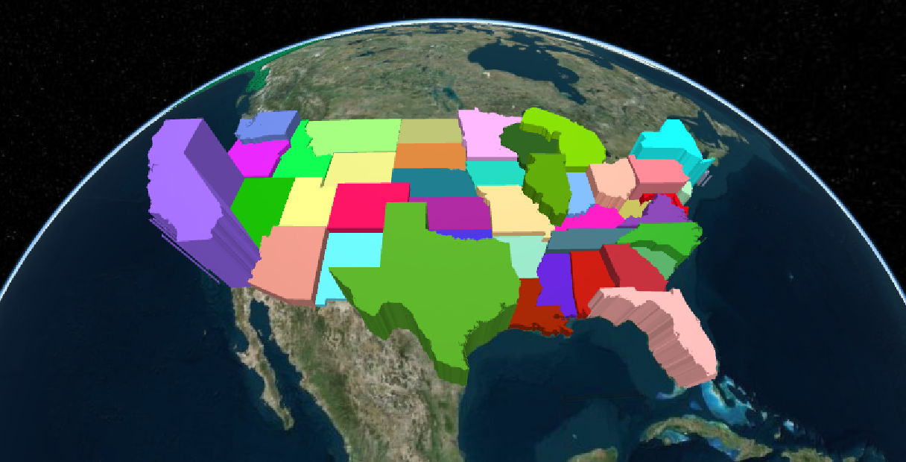
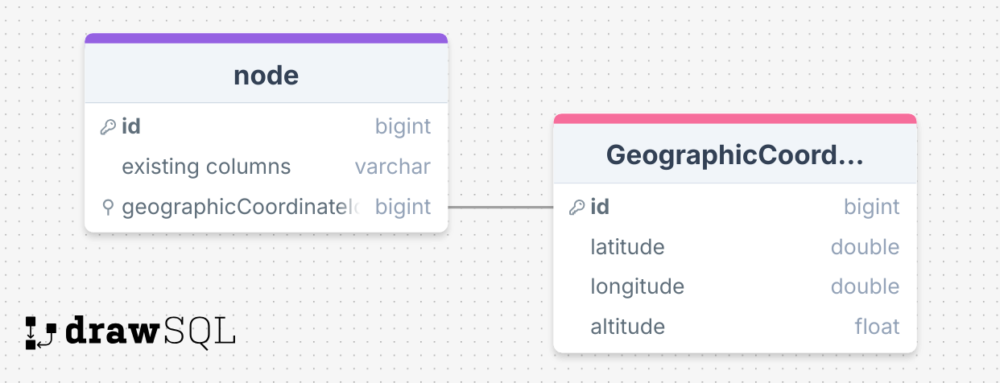
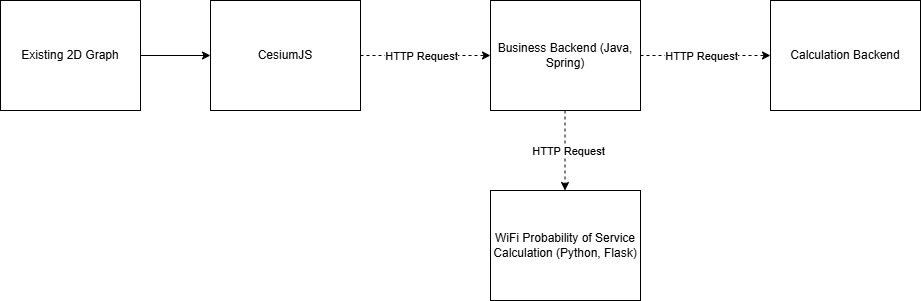

# Cesium Location Data

We currently have a 2D graph space where connections and distance are purely logical; the nodes may be very close together or very far apart and it is impossible to tell. We want to add the ability to use WiFi connections, but WiFi depends heavily on relative positioning. That is where this solution comes into play.

Using Cesium, we are going to take our 2D graph and place everything into a 3D map of the globe. This allows geographic data to be stored and used to calculate the strength and throughput of WiFi connections.

However, it doesn't do that all by itself. Cesium is just the tool that renders things you give it on a globe. So, we have to build a tool around it to map 2D graph into a 3D space (default location is 0 latitude and 0 longitude, with 0 altitude, with some nuance). Users can move their nodes anywhere they need them on the map, storing that coordinate data in a database, which then can be used for WiFi Probability of Service calculations by converting these absolute positions into relative ones.

The nodes in the Demo screenshot of COLE will be able to be given position data, allowing the use of WiFi within our application. This will be the general structure of the solution given the existing backend services.

This project has already started, so until the end of class, I hope to continue improving on the calculations that the backend does, as well as improving the User Experience for those who use our feature and add additional data for users, such as customizing router configurations. By each class day I hope to improve upon at least one of these things.
